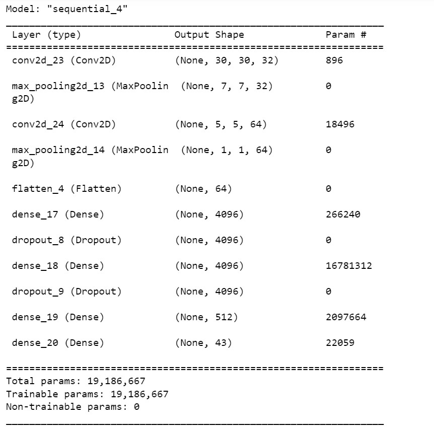

# Traffic Road Sign Detection

Datasets used for training:

1. Primary dataset was taken for training and testing from Udemy course:
    https://www.udemy.com/course/autonomous-cars-deep-learning-and-computer-vision-in-python/

2. All other datasets were used only for testing.

    https://www.kaggle.com/datasets/safabouguezzi/german-traffic-sign-detection-benchmark-gtsdb

    https://www.kaggle.com/datasets/bhavinmoriya/german-traffic-sign-recognition-benchmark

    https://www.kaggle.com/datasets/ibrahimkaratas/gtsrb-german-traffic-sign-recognition-benchmark

Below are the different CNN architectures used for prediction.

1. Alexnet with below architecture

2. Resnet with below architecture

3. Modified Alex net with below architecture

4. Architecture 2

5. Architecture 3

